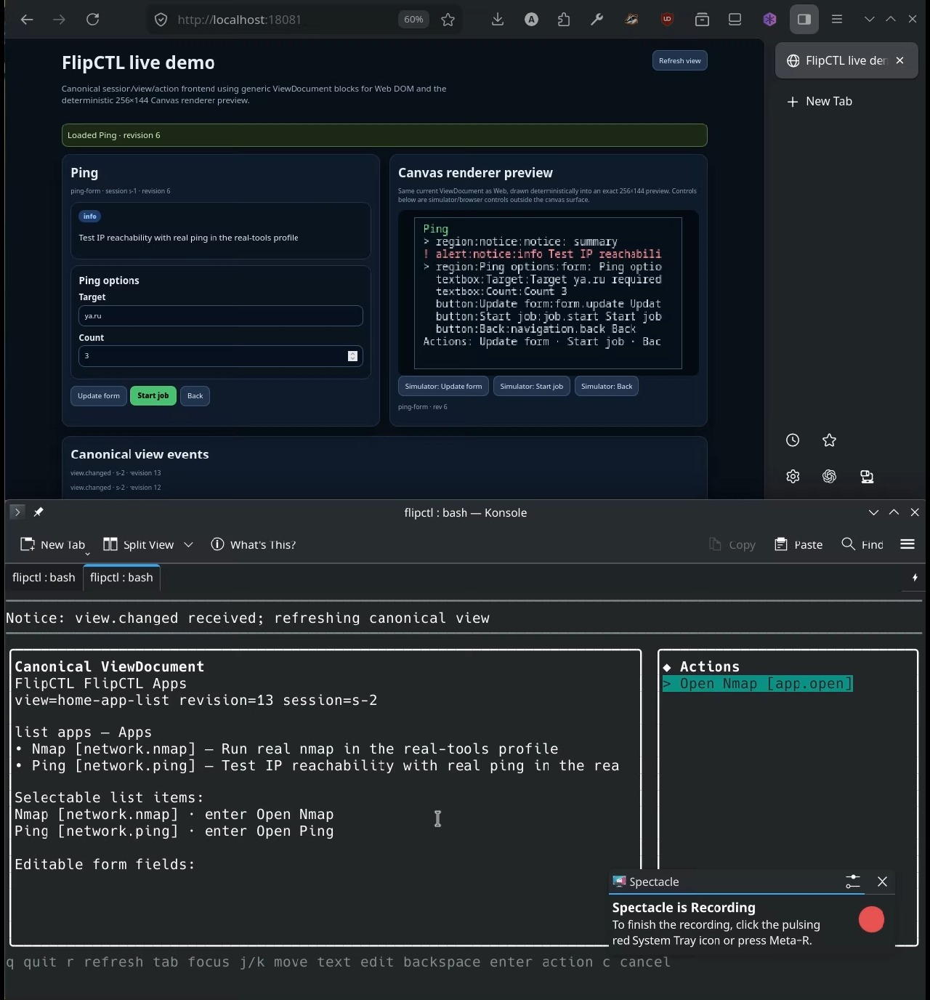
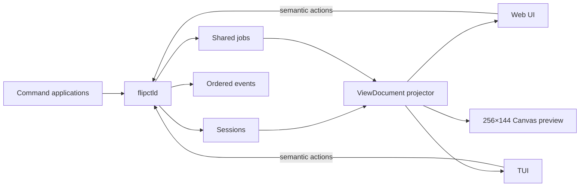

# FlipCTL architecture prototype

FlipCTL is a lightweight control layer for embedded and headless Linux systems.

This repository proposes one concrete way to implement the [official FlipCTL vision](https://docs.flipper.net/one/cpu-software/flipctl): a small daemon owns applications and system work, while Web, terminal, and constrained-display frontends present the same state in forms suited to their environment.

The prototype is intentionally narrow. It wraps Ping and Nmap, but its main purpose is to prove the architecture.

## Demo

Click the preview below to watch the demo video:

[](docs/demo.webm)

[Download the demo video](docs/demo.webm).

## What this prototype proves

- One daemon can drive both a Web UI and an interactive TUI.
- Frontends can navigate independently while sharing the same jobs and system state.
- A job started in one frontend can be observed and cancelled in another.
- Applications can be described without embedding Web, terminal, or Canvas UI code.
- The same semantic screen description can be rendered as browser controls, terminal widgets, or a 256×144 Canvas preview.
- The main userspace behavior can be tested without owning a Flipper One.



## Core idea

FlipCTL does not try to share Web components with terminal widgets.

Instead, the daemon publishes a small semantic document containing concepts such as forms, lists, notices, progress, logs, summaries, tables, and available actions. Each frontend decides how those concepts should look and behave on its own platform.

This follows the official principle that **data and UI logic are separated from the renderer**, while making the boundary concrete and testable.

## Main components

| Component | Responsibility |
|---|---|
| `flipctld` | Owns application discovery, frontend sessions, jobs, events, command execution, and view projection |
| Declarative command apps | Describe inputs, command arguments, parser choice, and execution limits |
| `ViewDocument` | Versioned renderer-neutral description of the current session view |
| Web UI | Accessible browser renderer and action client |
| TUI | Keyboard-driven terminal renderer and action client |
| Canvas preview | Demonstrates the same document within the Flipper One 256×144 display constraints |
| Fake command environment | Makes the architectural flow deterministic in local tests and CI |

## Why sessions and jobs are separate

A **session** belongs to one frontend. It stores navigation, form values, selection, and the revision of the screen currently shown.

A **job** belongs to the daemon. It can continue after a frontend disconnects and can be observed by more than one session.

This distinction is what allows Web and TUI clients to navigate independently while operating on one shared system.

## Plugin direction

The MVP uses declarative command applications for wrappers such as Ping and Nmap. They are small, inspectable, and sufficient to prove multi-frontend behavior.

The proposed evolution is incremental:

1. **Declarative command apps** for common command-line tools.
2. **Supervised native plugins** for complex, long-lived integrations.
3. **WebAssembly components** as a future option for strongly isolated third-party logic.

The later tiers are intentionally not prerequisites for the prototype.

## Try the proof

```bash
make check
make demo
```

Then open the [Web UI](http://localhost:8080/) and start the TUI against the same daemon:

```bash
go run ./cmd/flipctl-tui -addr http://localhost:8080
```

To run the demo fully containerized with the real Ping and Nmap wrappers, use the helper scripts under `tmp/` from the repository root. The start script builds and launches the `real-tools` Docker Compose profile, waits for the daemon on `http://localhost:18081/readyz`, and serves the Web UI at <http://localhost:18081>. Jobs run against real targets such as `ya.ru` or `example.com`.

```bash
./tmp/start-real-tools-demo.sh
./tmp/run-tui-real-tools.sh
./tmp/stop-real-tools-demo.sh
```

Use `./tmp/run-tui-real-tools.sh` from another terminal while the containerized daemon is running. Use `./tmp/stop-real-tools-demo.sh` when finished to bring the Compose stack down and remove orphaned containers for the demo project.

The most important acceptance scenario is:

1. Web and TUI create separate sessions.
2. Web starts a deterministic Ping job.
3. TUI sees the same job.
4. TUI cancels it.
5. Web receives the update and renders the cancelled state.

Docker and ARM64 userspace smoke tests exercise the same canonical flow. They do not claim to emulate Flipper One hardware.

```bash
make docker-fake-smoke
make arm64-userspace-smoke
```

The ARM64 smoke test runs an ARM64 userspace container through Docker/QEMU. On a local machine, register ARM64 `binfmt_misc` support first if Docker reports `exec format error`:

```bash
docker run --privileged --rm tonistiigi/binfmt --install arm64
```

## Deliberate MVP boundaries

This proposal does not yet choose the final answer for every product decision.

- Canvas is a renderer preview, not a finished physical-device frontend.
- Sessions and jobs are in memory.
- Physical display startup, MCU input, and framebuffer transfer require hardware validation.
- Native and Wasm plugin runtimes remain future decisions.
- Production service, networking, and hardware adapters remain behind future typed host interfaces.

These are documented as decision handoffs rather than hidden gaps.

## Documentation

- [Architecture proposal](docs/architecture.md)
- [Decisions, handoffs, and roadmap](docs/decisions-and-roadmap.md)
- [ViewDocument contract](docs/view-document.md)
- [Plugin model](docs/plugin.md)
- [Testing strategy](docs/testing.md)

## Relationship to the Flipper One vision

This proposal is guided by the official project material:

- [FlipCTL vision and contribution brief](https://docs.flipper.net/one/cpu-software/flipctl)
- [Flipper One UI and 256×144 display constraints](https://docs.flipper.net/one/user-interface/about)
- [MCU↔CPU interconnect](https://docs.flipper.net/one/mcu-firmware/mcu-cpu-interconnect)
- [General Flipper R&D Debian testing environment](https://docs.flipper.net/one/testing/general)
- [Supported RK3576 boards](https://docs.flipper.net/one/cpu-software/supported-boards)

The repository is an implementation proposal, not a claim that every product and hardware decision is final.
