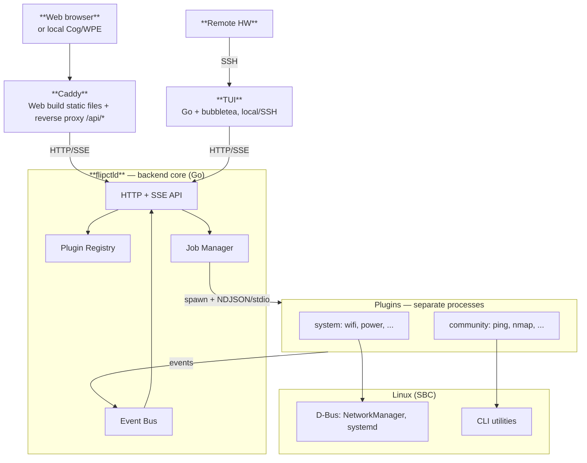
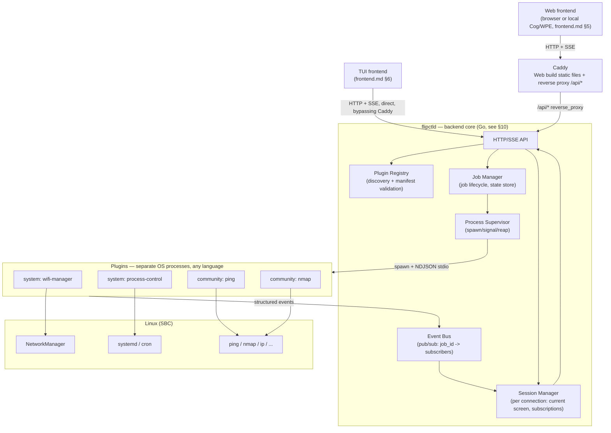
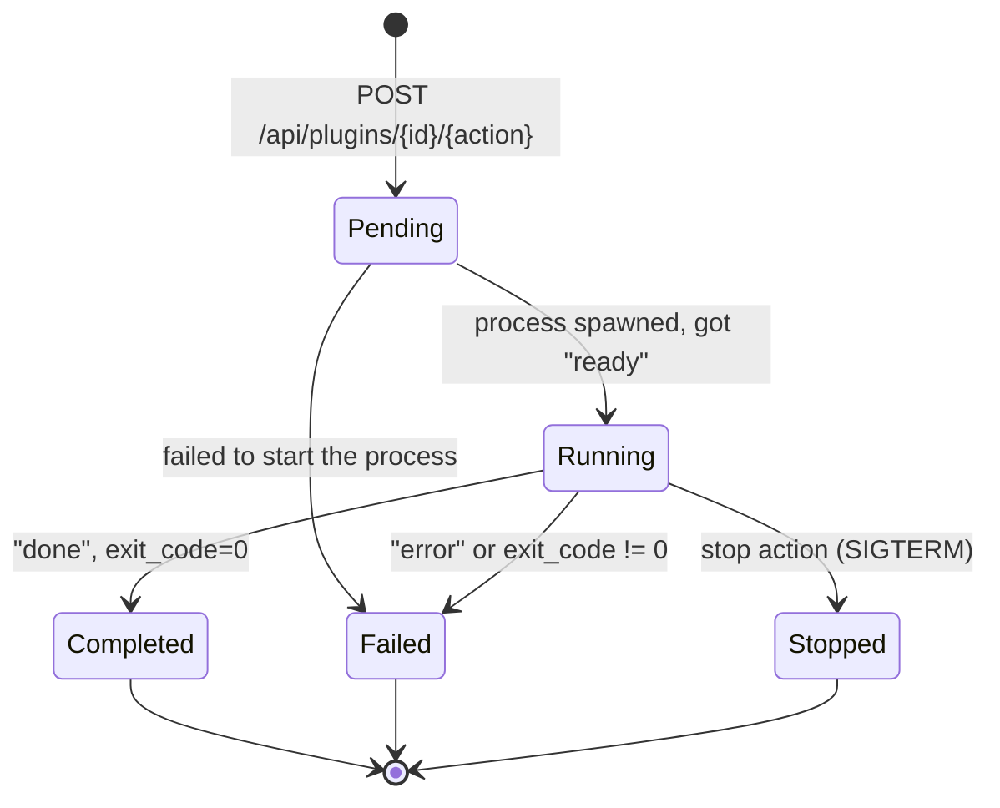
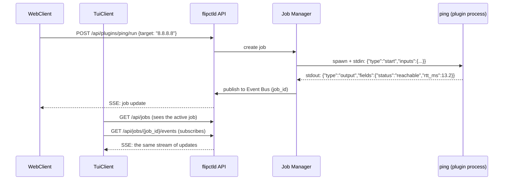
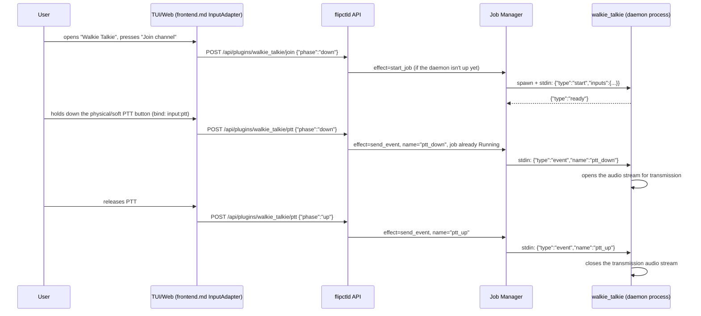

# FlipCTL — Backend and Plugin System Architecture (proposal)

> Goal of the whole FlipCTL project: provide a convenient way to use Linux tools (network utilities, systemd, process management, etc.) through a small-screen interface — whether that's a physical panel, a TUI over SSH, or a web page. The backend is the part of the system that knows how to talk to Linux, and decides what part of that conversation to expose outward.

> Scope of this document: **Backend** and the **plugin system** from FlipCTL's overall design (see `README.md`). Companion document — [`frontend.md`](./frontend.md), where the Web/TUI renderers and the API contract the backend must implement are designed (in particular `GET /api/registry` from frontend.md §4.2). Unlike frontend.md, here the backend is no longer a black box — this document describes what `server.js` ultimately becomes. A package manager for installing/updating plugins is out of scope; only launching and running plugins already present on disk is covered here.

## High-level overall architecture (for reference)



## 1. Why `server.js` doesn't scale

Today's `server.js` (see the analysis in `frontend.md`) is a single ~5000-line file where every system capability (Wi-Fi, Ethernet, sound, LEDs, power) has its own HTTP handler that spawns the relevant Linux utility and **itself** parses its text output with regexes. This works as a proof of concept, but it doesn't scale:

| Problem with `server.js` | Consequence |
|---|---|
| All logic lives in one process/file | Adding a new capability means editing a central file that grows without bound |
| Utility-output parsing lives inside the server itself | The author of a new integration has to dig into the server's code and learn its conventions |
| No isolation between functions | One parser crashing/hanging can potentially take down the whole backend |
| No model of "what's running right now" | Can't show the user a list of active operations, can't cleanly stop a long-running one |
| Doesn't assume multiple simultaneous clients | Concurrency is neither bounded nor managed — it's just "whatever happens" |
| No separation between "we wrote this" and "the community wrote this" | Any extension is done the same way as system code |

These are exactly the points that become requirements for the new architecture below.

---

## 2. Key decisions

1. **The backend core (`flipctld`) is a thin generic supervisor, not a store of business logic.** All "integrations with Linux" (Wi-Fi, ping, nmap, LEDs, cron, power) are implemented as **plugins** — separate processes that the core launches and talks to over a fixed protocol. The core doesn't know what `nmap` is; it knows how to spawn a process, send it structured messages, and receive structured events back.
2. **Plugin isolation — separate OS processes.** Every plugin, system or community, runs as an independent process communicating with the core over the IPC protocol (section 5). This gives: freedom of language choice for the plugin author (the only requirement is being able to read/write JSON over stdin/stdout, which every language can do), resilience (a plugin crashing doesn't take down the core), and a natural point for a future sandbox (section 12) — today all plugins are equally trusted, but the boundary for privilege separation is already drawn architecturally, right at the process level.
3. **The backend supports several simultaneously connected UI clients with shared visible state.** If someone on Web starts an `nmap` scan, someone else on TUI over SSH should be able to see that the scan is running and connect to its output in parallel. Job state isn't tied to a client — it lives in the core; clients are subscribers (section 6).
4. **The privilege/sandbox model for plugins is deliberately deferred.** All plugins currently run at the same trust level. The `tier: system | community` split in the manifest (section 4) is fixed now as metadata, but **doesn't affect execution** — only UI grouping, and the future (section 12, which also spells out the explicit security risk of the current setup).
5. **Core stack — Go.** Decision locked in: Go is the primary tool for `flipctld` (process supervisor + HTTP/SSE API — exactly the niche where Go has direct precedent: Docker, Kubernetes, the HashiCorp stack). The comparison with Rust stays in section 10 as a documented concern/TBD — not because the decision is in question, but because switching stacks stays cheap: the architecture is designed to barely depend on the core's language (the boundaries are processes and JSON over stdio, not shared memory/FFI).
6. **Serving Web static files and handling external ingress is separate from `flipctld`, via Caddy.** `flipctld` stays an API server only (plugins/jobs), not a frontend host. `Caddy` sits in front of it (section 3.1) — serves the built Web bundle as static files and reverse-proxies `/api/*` to `flipctld`. A deliberate cost — a second resident process on the SBC, which formally contradicts the resource-saving theme from `frontend.md §1` — accepted for a low barrier to entry (a few lines of Caddyfile, TLS/auth nearly free in the future) and a fully independent build/release cycle for the Web frontend from the backend binary. The alternative (`flipctld` serving static files itself, no separate process) remains a cheap fallback if resource savings ever outweigh convenience — a config change, not an architectural dead end.

---

## 3. Top-level architecture



`flipctld` is the core's single resident process (the analogue of today's `server.js`, but with no business logic inside and no web-server duties). It's also what serves the entire API described in `frontend.md` (`GET /api/registry` and onward). Serving Web static files and handling external ingress is handled by `Caddy` — section 3.1.

### 3.1 Caddy — the entry point for Web

`Caddy` is the only process that listens on the "external" HTTP port (both locally for Cog/WPE, and for a browser from outside if the device is reachable over the network). It has exactly two jobs, both configuration, not code:

```
:80 {
    handle /api/* {
        reverse_proxy localhost:8899
    }
    handle {
        root * /usr/share/flipctl/web
        file_server
    }
}
```

- **Serve the built Web bundle** (`web/apps/web/dist` after `vite build`, `frontend.md §10`) as static files — Caddy doesn't know and doesn't need to know what's inside, it's just files.
- **Proxy `/api/*` to `flipctld`** — from the Web code's point of view (`fetch('/api/registry')`) nothing changes; Caddy is transparent to the contract in `contract/openapi.yaml`.

**Cog/WPE points at Caddy, not directly at `flipctld`** (`cog http://localhost:80/`) — the local kiosk and an external browser go through the same entry point, with no special case for the local client.

**TUI bypasses Caddy** and talks to `flipctld` directly (`frontend.md §6.4`) — it doesn't need static file serving, and an extra proxy hop gives a native client no benefit. A single entry point is a property of Web access, not a universal requirement for every client.

If resource savings on the SBC ever outweigh the convenience of a separate process — migrating to `flipctld` serving static files itself (no Caddy) requires porting the `Caddyfile`'s contents into a couple of lines of Go code, not reworking the architecture.

---

## 4. Plugins

### 4.1 Manifest

Every plugin is a directory with a manifest (`manifest.toml`) and an entry point (an executable in any language). The manifest describes both what `flipctld` needs (how to launch it, what fields to expect) and what the frontend needs (how to draw it — a projection in `frontend.md §4.2`).

```toml
# plugins/community/ping/manifest.toml
id = "ping"
title = "Ping"
version = "0.1.0"
icon = "network-ping"
category = "diagnostics"

tier = "community"          # "system" | "community" — metadata, doesn't affect execution (§2.4)
execution = "stream"        # "one-shot" | "stream" | "daemon" — see §4.2
ui_kind = "generic"         # "custom" | "generic" — projected into GET /api/registry (frontend.md §4.2)

entrypoint = "bin/ping-plugin"   # relative to the plugin directory, any runtime

[permissions]                     # DECLARED, NOT YET ENFORCED (see risks §12)
declared = ["network.raw_socket"]

[[inputs]]                        # what the user configures before/while running
id = "target"
label = "Target"
type = "text"
required = true

[[inputs]]
id = "interval"
label = "Interval"
type = "select"
options = ["1s", "5s", "continuous"]
default = "1s"

[[actions]]                       # what the UI triggers (buttons/soft-buttons) — more in §4.4
id = "run"
label = "Run"
bind = "slot:2"                   # position on the screen's soft-button panel
on_press = { effect = "start_job" }

[[actions]]
id = "stop"
label = "Stop"
bind = "slot:4"
on_press = { effect = "stop_job" }

[[outputs]]                       # the structure of fields the plugin will send (§5)
id = "status"
label = "Status"
type = "text"

[[outputs]]
id = "rtt_ms"
label = "RTT"
type = "number"

[[outputs]]
id = "log"
label = "Log"
type = "list"
```

`inputs`/`outputs`/`actions` are exactly what lets a plugin author, in the terms used during the discussion, "return a list of parameters for dropdown 2" or "put a string into field 1": field types (`text`, `number`, `select`, `list`, and `table` in the future) are primitives that already exist or will exist in both frontends' UI Kit (`frontend.md` sections 5-6). The manifest doesn't draw the UI itself — it just tags data with these primitives; the actual layout/icons/styling is decided by the frontend, as before.

The `kind: "generic"` schema in `frontend.md §4.2` has been extended to cover `inputs`/`select`/`list` — now the same example plugin (`ping`) with the same fields appears in both documents with no discrepancies.

### 4.2 Three axes of plugin classification

The manifest describes a plugin along three independent axes at once — important not to confuse them:

| Axis | Values | What it determines |
|---|---|---|
| **`tier`** (trust) | `system` \| `community` | Who's responsible for quality/mandatoriness (§2.4); in the future, the privilege/sandbox level. Doesn't affect execution today. |
| **`execution`** (execution model) | `one-shot` \| `stream` \| `daemon` | How the job behaves (§4.3), how long the process lives. |
| **`ui_kind`** (presentation) | `custom` \| `generic` | Whether the UI draws its own screen (Wi-Fi, Ethernet) or uses the shared `GenericActionScreen`/`generic_action.rs` (`frontend.md §4.2/§6.2`). |

Example: `wifi-manager` — `tier: system`, `execution: daemon` (constantly watches the radio interface's state), `ui_kind: custom` (Wi-Fi has a complex screen with a network list and password entry). `ping` — `tier: community`, `execution: stream`, `ui_kind: generic`.

### 4.3 Execution models and Job

- **`one-shot`** — the process starts, does its work, emits one final result, exits. Example: a one-off `df` (disk) check, an `iperf` test. The job moves `Running → Completed` automatically on receiving `done`.
- **`stream`** — the process lives for as long as the operation runs, and keeps sending events. Example: `ping` (until stopped), traffic capture, a long `nmap` scan with progress. The job moves to `Completed`/`Stopped` on an explicit signal or the process exiting naturally.
- **`daemon`** — the process starts **together with `flipctld`** (not on request from a specific screen) and lives permanently, regardless of whether any client is currently looking at it. Example: a network-LED controller, the Power-button handler. Such plugins don't create a "job" in the usual sense — they register themselves and live as a system service under the Process Supervisor's watch, restarting automatically on crash.

### 4.4 Soft buttons: how a press turns into an event inside a plugin

The device (in Web, in TUI, and on the physical panel alike) has a limited set of soft buttons under the screen — the same 5-slot button bar from `fake-flipctl2`. A plugin needs to be able to: (a) give these buttons its own labels, (b) decide what happens on press/release, and (c) for an already-running process — receive that as an **event**, not as a fresh restart. That's why `[[actions]]` isn't just "button → HTTP endpoint," but a declaration with three parts:

- **`bind`** — which button the action is responsible for:
  - `slot:0..4` — a specific position on the plugin's current screen's soft-button panel (numbered the same way as `fake-flipctl2`'s existing 5-slot panel). If `bind` isn't specified, the frontend lays the action out in the first free slot in manifest declaration order.
  - `input:<name>` — a binding not to a specific slot, but to a **universal** semantic action from the `input-actions` contract (`frontend.md §4.1`), e.g. `input:ptt`. Such actions are already wired into the UI as physical/reserved (Ptt is exactly the case from the `walkie_talkie.js` prototype), and the plugin simply subscribes to an already-existing button without occupying one of the 5 slots.
- **`on_press`/`on_release`** — separate reactions to pressing and releasing (needed for push-to-talk and any "hold to do X"). If `on_release` isn't specified, releasing is ignored and the button behaves like an ordinary tap.
- **`effect`** inside `on_press`/`on_release` — what actually happens:
  - `start_job` — create a job (as before — the only option in the document's first version).
  - `stop_job` — a `SIGTERM` signal to the plugin's active job (as before).
  - `send_event` — **new**: if a job is already `Running`, send a named event to its stdin (section 5) without touching the process's lifecycle. If there's no active job — a no-op with an error in the response (see risks §12).

Example — `walkie_talkie` (`tier: system`, `execution: daemon`, `ui_kind: custom`, a direct analogue of `fake-flipctl2/js/apps/walkie_talkie.js`):

```toml
[[actions]]
id = "join"
label = "Join channel"
bind = "slot:2"
on_press = { effect = "start_job" }   # brings up the audio daemon if not already up

[[actions]]
id = "ptt"
label = "Talk"
bind = "input:ptt"                     # universal physical PTT button, not a slot
on_press   = { effect = "send_event", name = "ptt_down" }
on_release = { effect = "send_event", name = "ptt_up" }
```

Here `join` starts a long-lived process once (if it isn't already up thanks to another client — the job is shared, multi-client §6), and every PTT press/release doesn't create a new process, it just feeds events to the one already running — exactly what's needed for a live audio stream.

> Technical debt between the documents: the slot panel (`slot:0..4`) isn't formally captured anywhere in `frontend.md` today as a standalone UI Kit primitive — there are button widgets there, but no declarative "panel of N addressable slots, driven by external data." Such a primitive needs to be added to `frontend.md` sections 5-6 (see also section 11 below).

### 4.5 System plugins and D-Bus: don't spawn a CLI, call the service directly

The `flipctld` ↔ plugin protocol (NDJSON over stdio, section 5) doesn't change — it stays the lowest barrier to entry for any language. But **inside** a `tier: system` plugin that wraps an OS subsystem, there's a wrong way and a right way to do it:

- **Wrong** (repeats `server.js`'s problem from section 1): the plugin spawns `nmcli`/`systemctl` as a child process and parses its text stdout with regex.
- **Right**: `NetworkManager`, `systemd`, `logind`/`UPower` (power/battery), `BlueZ` are themselves already D-Bus services (`org.freedesktop.NetworkManager`, `org.freedesktop.systemd1`, ...) with typed methods and **signals** for state changes. The plugin holds a regular D-Bus client internally (`dbus-python`, `zbus`/`dbus-rs`, `godbus`, `dbus-next` — every language has a library) and calls methods/subscribes to signals directly — no text parsing, no polling (subscribing to `PropertiesChanged` instead of polling once a second).

For `flipctld`, this is fully transparent: from the outside, the plugin still just sends NDJSON to stdout like any other. D-Bus is an implementation detail of a specific `tier: system` plugin, not part of the core's protocol. A recommendation, not a requirement: a community plugin wrapping `ping`/`nmap` isn't touched by D-Bus at all — that's exactly where it's fine to stay at "just spawn the utility," since a CLI utility has no D-Bus API.

The author of a `tier: system` plugin doesn't need to research NetworkManager/systemd's D-Bus API from scratch — it's a documented, stable protocol with ready-made client libraries for most languages: `libnm`/`python-networkmanager` (Python), `zbus` (Rust), `godbus` (Go), `dbus-next` (Node). NetworkManager's own official `nmcli`/`nmtui` aren't code to reuse (they're separate full-screen programs, they don't embed into our Navigator/Screen stack), but they're a good reference for the range of capabilities worth covering in our own Wi-Fi screen (network list, connect, forget network, hotspot).

---

## 5. IPC protocol: NDJSON over stdio

The simplest protocol, requiring nothing from a plugin author beyond being able to write to stdout and read stdin — works the same in Bash+`jq`, Python, Node, Go, Rust, anything.

**Core → plugin** (stdin). For `one-shot`/`stream` — a single starting line at spawn time; for `stream`/`daemon`, stdin **stays open for the process's entire lifetime** — this is exactly how soft-button events (section 4.4) arrive, not just the starting parameters:

```json
{"type":"start","inputs":{"target":"8.8.8.8","interval":"1s"}}
{"type":"event","name":"ptt_down"}
{"type":"event","name":"ptt_up"}
```

**Plugin → core** (stdout, a stream of NDJSON lines):

```json
{"type":"ready"}
{"type":"output","fields":{"status":"reachable","rtt_ms":13.2}}
{"type":"log","line":"64 bytes from 8.8.8.8: icmp_seq=1 ttl=117 time=13.2 ms"}
{"type":"done","exit_code":0}
{"type":"error","message":"host unreachable"}
```

- `output` — updates the job's current state with fields declared in the manifest's `outputs`. This is what subscribed clients see and what's returned by `GET /api/jobs/{id}`.
- `log` — a raw line for history/debugging, not required to map to any specific UI field.
- `done`/`error` — the job's terminal states.
- `event` (core → plugin) — what a soft-button press/release with `effect: send_event` (section 4.4) turns into. The plugin itself decides what to do with it (e.g. open/close an audio stream on `ptt_down`/`ptt_up`) — the core just delivers the named event without interpreting it.
- Stopping (the `stop_job` effect) doesn't require a separate protocol message for the PoC — the core simply sends `SIGTERM` (escalating to `SIGKILL` after a timeout) to the job's process. A plugin may additionally listen for `{"type":"stop"}` on stdin for a graceful shutdown — optional, not required for the PoC.

A plugin author, then, writes "business logic on top of an existing Linux utility" in exactly the sense discussed: they call `ping`/`nmap` however they like, parse the output themselves (this is their responsibility, not the core's — a direct fix for `server.js`'s problem from section 1), and hand back an already structured result, tagged according to `outputs`.

---

## 6. Job / Session / Event Bus



- **Job** — the state of one plugin-action execution: `id`, `plugin_id`, `inputs`, current `outputs`, status, start time. For the PoC — a simplifying assumption: **one active job per plugin id at a time** (a second `run` for an already-running `ping` — an error or an implicit restart, not parallel jobs). Explicitly limits scope, to be lifted later if needed (section 12).
- **Session** — the state of one connected client: `connection_id`, the currently open screen (`current_screen_id` — this is the "screens/views" from the discussion), the list of jobs it's subscribed to. Used so as not to send SSE events to a client currently looking at a different screen, and to decide which `daemon`/`stream` jobs are worth keeping active (where that's appropriate for a given plugin).
- **Event Bus** — an internal pub/sub: every `output`/`log`/`done`/`error` from a plugin is published under the key `job_id`; the `Session Manager` delivers it to every client subscribed to that `job_id` over SSE. A job is shared across all clients (the multi-client requirement, §2.3): anyone can subscribe to an already-running job, not just whoever started it.



---

## 7. HTTP/SSE API — the contract for the frontend

A continuation of the `api-contract` from `frontend.md §4.3`/§9, now fully specified:

| Method | Path | Purpose |
|---|---|---|
| `GET` | `/api/registry` | List of apps/plugins (`frontend.md §4.2`), a projection of manifests |
| `POST` | `/api/plugins/{id}/{action}` | Execute a manifest action. The body `{"phase": "down" \| "up"}` selects `on_press`/`on_release` from the manifest (section 4.4); the effect is `start_job`/`stop_job`/`send_event`. Responds with `{"job_id": "..."}` for start, `{}` otherwise |
| `GET` | `/api/plugins/{id}/status` | A cheap synchronous read of the latest state — for simple, always-alive `system`/`daemon` plugins (Wi-Fi, Power), without creating a job |
| `GET` | `/api/jobs` | List of active jobs across all clients (an App-Switcher analogue from `frontend.md`, but at the backend level) |
| `GET` | `/api/jobs/{job_id}` | A snapshot of a job's current state |
| `GET` | `/api/jobs/{job_id}/events` | An SSE stream of a job's structured events |

Both Web (`fetch`/`EventSource`) and TUI (`net/http` + line-by-line SSE parsing) talk to this API the same way — exactly as already designed in `frontend.md` sections 5 and 6.4. Being in the same language as `flipctld`, the TUI uses a shared generated Go package for request/response types (`contract/go/apitypes`, `frontend.md §9`) rather than hand-written structs.

---

## 8. Plugin discovery (no package manager)

A package manager is out of scope, but loading plugins already present on disk needs to be defined:

```
/usr/lib/flipctl/plugins/system/<id>/manifest.toml   # we write and ship these
/etc/flipctl/plugins/<id>/manifest.toml               # community, installed manually / by a future manager
```

At startup, `flipctld` scans both directories, validates manifests against a formal schema — `contract/manifest.schema.json` (JSON Schema, draft 2020-12; the manifest is validated against its TOML→JSON representation) — and builds an in-memory `Plugin Registry`, which is what's served through `GET /api/registry` (response shape — `contract/openapi.yaml`, the `RegistryEntry` schema). A plugin with an invalid manifest is logged and skipped, without blocking the rest from starting (a single point of failure shouldn't take down the whole backend — the same isolation principle as at the process level).

---

## 9. Examples: end-to-end

### 9.1 `ping` — start/stop job, different clients see one stream

1. `flipctld` starts, scans `/etc/flipctl/plugins/ping/manifest.toml`, adds it to the registry with `ui_kind: "generic"`.
2. Web/TUI request `GET /api/registry`, get a "Ping" card in the shared app list, render it via `GenericActionScreen`/`generic_action.rs` — not a single line of code specific to ping was needed.
3. A user on Web opens "Ping," types `target = 8.8.8.8`, presses "Run" (`bind: slot:2`, `on_press: {effect: start_job}`) → `POST /api/plugins/ping/run {"phase":"down"}`.
4. `flipctld` spawns `bin/ping-plugin`, sends `{"type":"start","inputs":{"target":"8.8.8.8","interval":"1s"}}` on stdin.
5. `ping-plugin` (say, a simple Python script wrapping the system `ping`) calls `ping -i 1 8.8.8.8` itself, parses its line-by-line output, emits `output` events with `status`/`rtt_ms` fields, and duplicates raw lines as `log`.
6. `flipctld` publishes the events to the Event Bus under `job_id`; Web receives them over its already-open SSE connection.
7. A user on TUI over SSH opens the same "Ping" in parallel — sees in `GET /api/jobs` that the job is already running, subscribes to `/api/jobs/{job_id}/events`, sees the same live RTT.
8. The user on Web presses "Stop" → `POST /api/plugins/ping/stop` → `flipctld` sends `SIGTERM` to the job's process → `ping-plugin` exits → `done` → the job goes `Stopped` → both clients see the final state.

### 9.2 `walkie_talkie` — an event into an already-running process (push-to-talk)

Unlike `ping`, here a button press shouldn't spawn a new process — it needs to reach an audio daemon that's already running. This is exactly the `effect: send_event` case from section 4.4.



Key difference from 9.1: between `join` and `ptt` it's one and the same job (`plugin_id = "walkie_talkie"`); `ptt` doesn't create new processes and doesn't go through `Pending`/`Completed` — it's just delivering an event to an already-open stdin.

---

## 10. Stack: Go (Rust — a documented concern/TBD)

**Decision: Go is the primary tool for `flipctld`.** The table below isn't kept around as an open question, but as a deliberately preserved reason to revisit it in the future — if a concrete reason comes up, the comparison can be revisited concretely rather than abstractly.

| | Go (chosen) | Rust (concern/TBD) |
|---|---|---|
| Precedents specifically for "process supervisor + plugin system + API" | Docker, Kubernetes, HashiCorp (Nomad/Consul/Vault) | Fewer direct precedents in exactly this niche |
| Concurrency (many jobs, many subscribers) | Goroutines/channels — low barrier to entry | `tokio` — comparable capability, higher barrier to entry |
| Barrier to entry for core contributors (not plugin authors — plugins can be in any language regardless) | Lower | Higher |
| Synergy with the TUI frontend (`frontend.md §6`) | **Achieved** — the TUI has been rewritten in Go (`bubbletea`), a shared generated Go package for api-contract types (`contract/go/apitypes`, section 11.1) | Would have required keeping the TUI on Rust — the decision was revisited specifically for this synergy |
| Resident footprint on the SBC | Small (static binary, GC slightly heavier than Rust but noticeably lighter than Node) | Minimal |

Originally the TUI was on Rust (`ratatui`) and the languages didn't match — synergy with the backend was only documented as a hypothetical bonus of the "Rust for both" option (section 11.1 below describes exactly how the decision was revisited). The TUI has since been rewritten in Go specifically for this synergy — it's no longer hypothetical.

### Repository structure (Go)

```
flipctld/
├── cmd/flipctld/              # main, starts the HTTP/SSE server
├── internal/registry/         # discovery + manifest validation
├── internal/supervisor/       # spawn/signal/reap of plugin processes
├── internal/jobs/             # Job Manager, state store, IPC codec (NDJSON)
├── internal/eventbus/         # pub/sub job_id -> subscribers
├── internal/session/          # Session Manager (per-connection)
├── internal/api/              # HTTP handlers + SSE
└── plugins/
    ├── system/                # we write and ship these: wifi, power, process-control, cron, ...
    └── community/              # ping, nmap, ... (local development/examples only)
```

Alongside, outside the `flipctld` tree (a separate process, section 3.1) — `deploy/Caddyfile`, configuration, not code.

---

## 11. Relationship to `frontend.md`

| What | `frontend.md` assumed | `backend.md` now specifies |
|---|---|---|
| `GET /api/registry` | A required new backend endpoint, response shape with `kind: custom\|generic` | Implemented as a `Plugin Registry` projection (section 8); the `kind` field in the response = the manifest's `ui_kind` field (section 4.2) |
| `/api/plugins/{id}/{action}` | Mentioned in the generic-schema example as an action endpoint | Fully specified (section 7): creates/signals a Job, returns `job_id` |
| "The existing `/api/wifi`, `/api/power`, ..." (`frontend.md` section 3, flagged as an immutable black box) | A black box, out of scope | No longer a black box: they become `tier: system` plugins (`wifi-manager`, `power`) with `ui_kind: custom`, reachable via `/api/plugins/{id}/status` for cheap reads — the HTTP paths themselves stay put, the implementation behind them changes entirely |
| Icons/semantic names in the registry | Resolved by Web into a sprite, by TUI into a text label | The source of the `icon` field in the registry is the plugin manifest (section 4.1), no change to the model |
| Screen soft buttons (`fake-flipctl2`'s 5-slot panel) | Mentioned as widgets (`LeftButton`/`MiddleButton`/`RightButton` in the UI Kit), but with no declarative mechanism for "what controls each slot" | Fully specified by the manifest (section 4.4): `bind: slot:0..4 \| input:<name>`, `on_press`/`on_release`. Requires a new UI Kit primitive in `frontend.md` — a panel driven by registry data rather than hardcoded per screen |

`frontend.md`'s header currently describes the backend as "a black box... doesn't change" — that's true with respect to the API contract (the frontend shouldn't have to rewrite anything), but not with respect to the backend's implementation, which this document completely reworks. The wording in `frontend.md`'s header is worth fixing so it doesn't give the impression that the backend isn't being worked on at all — done as a small separate edit following this document.

### 11.1 TUI↔backend synergy achieved: both on Go

The original decision (see this document's history) was to accept different languages as-is: backend on Go, TUI on Rust (`ratatui`) — with manual two-way `api-contract` synchronization, and a language-neutral schema (JSON Schema/OpenAPI) as a cheap fallback in case manual synchronization ever became a real pain. That decision has been revisited: **the TUI has been rewritten in Go (`bubbletea`/`lipgloss`/`bubbles`, `frontend.md §6`)** specifically for this synergy.

The mechanism isn't "a language-neutral schema that generates structs in different languages" (that's still the scenario for the Go↔TypeScript pair — Web doesn't become Go), but direct reuse: `contract/openapi.yaml` is run through `oapi-codegen` **once**, producing the Go package `contract/go/apitypes` (`frontend.md §9`), which both `flipctld` and `flipctl-tui` import as an ordinary dependency. No manual struct synchronization between backend and TUI is needed — it's a single codebase at the type level, not two independent generators kept in sync against one schema.

How this differs from a full merge into one Go module/monorepo (also considered): `flipctld` and `flipctl-tui` remain separate Go modules in separate repositories/directories (matching the backend.md/frontend.md split), connected only through `contract/go/apitypes` as an ordinary dependency — not through direct imports of each other's internal packages. This preserves the clean separation of "what the backend decides" / "what the frontend decides" that the documents have maintained throughout, while fully achieving the synergy goal.

---

## 12. Risks and open questions

- **`flipctld`'s privileges and unsandboxed community plugins — the most serious current gap.** If the core runs with privileges sufficient for system plugins (managing NetworkManager/systemd often requires root or specific capabilities), and community plugins are spawned by that same core without dropping privileges, a community plugin gets the same privileges by default. This is deliberately deferred (§2.4) until real community plugins show up, but **it's a hole, not a neutral gap**. A concrete candidate for a solution, not an abstract "think about it" — the same two-layer stack NetworkManager/systemd themselves actually use: **D-Bus system bus policy** (`/etc/dbus-1/system.d/*.conf`) — a coarse bus-level filter ("can this UID even send messages to this service at all"), and on top of it **polkit** (`org.freedesktop.PolicyKit1`) — fine-grained authorization of a specific action for a specific caller (e.g. "let everyone read Wi-Fi status, but only trusted callers can change the system network profile"). This only works if each plugin has its own recognizable caller identity — meaning it directly depends on the plugin itself being a D-Bus client with its own identity (section 4.5), rather than `flipctld` proxying D-Bus calls on behalf of every plugin from the same process — otherwise polkit sees the same `flipctld` UID everywhere and can't tell system and community apart. Separately, there remains the question of "whose identity does the plugin process itself run under" (a `setuid` wrapper / a per-plugin systemd unit with `DynamicUser=`/`CapabilityBoundingSet=`) — that's what determines the identity polkit will see.
- **The "one active job per plugin id" restriction** (section 6) simplifies the PoC, but doesn't cover the realistic scenario of "pinging two hosts at once." Lifting the restriction means moving from `job_id` keyed by `plugin_id` to genuine multiple instances — not hard, but deliberately not done now.
- **Job persistence across `flipctld` restarts isn't designed** — state is in-memory only. On an embedded device that may reboot, the history/status of long-running operations (e.g. an unfinished nmap scan) will be lost. Fine for the PoC; a production version should plan upfront where to write this (e.g. a local sqlite journal).
- **Manifest validation — the structure is formalized, but not all the semantics.** `contract/manifest.schema.json` covers the shape (required fields, allowed `type`/`enum` values, conditional requirements like `options` when `type: select`). Checking for `bind` conflicts (two actions of the same plugin declaring the same `slot:N`) is a cross-item constraint that plain JSON Schema expresses poorly/awkwardly; that's left as a separate check in `flipctld`'s code at discovery time (section 8), not in the schema itself.
- **SSE vs. WebSocket for the Event Bus — risk resolved.** In the document's first version this was an open question: "if we ever need to send commands into an already-running job, we'll need WebSocket." Section 4.4/5 solves this without WS: commands (`send_event`) go over an ordinary `POST` (the client→backend direction was always request-driven anyway), and the backend itself forwards them to the process's stdin. SSE stays purely one-directional (backend→client) and that's enough.
- **`send_event` targeting a missing job.** If the user presses `ptt` and the `walkie_talkie` daemon isn't up for some reason (crashed, never `join`-ed) — the `POST` should return an explicit error (e.g. `409 Conflict` with a "job not running" message) rather than silently vanishing. The frontend needs to be able to show this (e.g. a disabled button state if `GET /api/jobs` shows no active job for that plugin_id) — this isn't specified in either document today.
- **Caddy — a second resident process on the SBC** (section 3.1), deliberately accepted for a low barrier to entry and an independent release for the Web frontend — a direct departure from the resource-saving theme that drove the Node/WASM decisions in `frontend.md §1`. Worth not forgetting: if this becomes a real problem rather than a hypothetical one (e.g. on a clear RAM shortage on weaker 1-2GB SBC variants), the way back — `flipctld` serving static files itself — is already described and cheap, and doesn't require reworking the rest of the architecture.
- **Caddy's access perimeter isn't designed.** Caddy is the point where it's decided whether the backend listens only on `localhost`/LAN or on literally any incoming traffic. Web access authorization has been deliberately pushed out of scope for this architecture as "a problem for the future" — but Caddy is exactly where it will get closed (TLS, basic auth, network allowlists) once its turn comes.

---

## 13. PoC roadmap

1. `flipctld`: an HTTP server + `Plugin Registry` (discovery, without formal-schema validation) + a static `GET /api/registry` over 2-3 test manifests.
2. `Process Supervisor` + `Job Manager`: implement the `one-shot` path end to end (spawn → NDJSON stdin/stdout → `done`) on one real plugin (e.g. `diskspace` — simple and requires no privileges).
3. Add the `stream` path + `Event Bus` + SSE (`/api/jobs/{id}/events`) — prove the multi-client scenario (section 9, steps 6-7) on `ping`.
4. Move one existing `system` path from `server.js` (e.g. Wi-Fi status, `ui_kind: custom`) to the new model — prove that the `frontend.md` contract (`/api/plugins/wifi/status`) required no changes to the frontend code.
5. A `daemon` path on one plugin with no real UI trigger (e.g. an LED controller) — prove that the Process Supervisor can hold and restart long-lived plugins separately from the job model.
6. `Caddyfile` (section 3.1): Web build static files + `reverse_proxy /api/*` to `flipctld` — prove that both the local Cog and an external browser land in the same UI without different client configuration.
