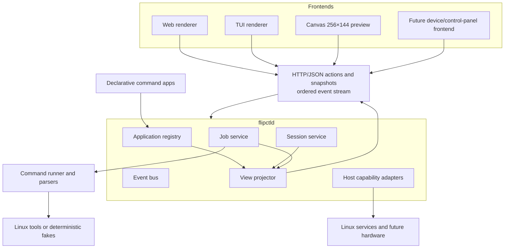

# FlipCTL architecture proposal

## 1. Context

The official FlipCTL vision describes a universal control interface for embedded and headless Linux systems. It should wrap operating-system services and familiar command-line tools, work without a traditional desktop, and support multiple frontends including Flipper One, Web, and TUI.

The central architecture problem is therefore not “how to draw a screen.” It is:

> How can one system expose the same applications and state through very different displays and input methods without reimplementing each application in every frontend?

This proposal answers that question with a daemon-owned application model and a renderer-neutral view contract.

## 2. Design goals

The architecture should:

- run as a small headless Linux service;
- support Web and TUI clients from the same backend;
- fit the Flipper One interaction model and 256×144 display;
- wrap tools such as Ping and Nmap without shell-specific UI;
- let frontends disconnect without destroying background work;
- be useful in Docker and on ordinary Linux before hardware is available;
- leave room for system services, hardware adapters, and richer plugins.

The MVP is not intended to finalize every deployment, security, or hardware decision.

## 3. Proposed structure



## 4. Ownership and handoffs

Clear ownership is more important than a large framework.

| Boundary | Producer owns | Consumer owns |
|---|---|---|
| Application → daemon | Inputs, command template, parser, capability requirements | Validation, execution, jobs, lifecycle |
| Daemon → frontend | State, semantic blocks, available actions, revision | Layout, focus, input mapping, visual style |
| Session → job | User intent and selected parameters | Execution and terminal state |
| Job → projector | Raw/parsed result and progress | Converting it into generic UI concepts |
| Event bus → client | Ordered change notifications | Reconnect, refetch, local presentation |
| Host adapter → core | Linux or hardware capability | Product-level orchestration |

This prevents application plugins from knowing about HTML or terminal widgets and prevents frontends from learning how Ping or Nmap are executed.

## 5. Canonical view contract

A frontend receives a versioned `ViewDocument` snapshot for its session.

The MVP vocabulary is intentionally small:

```text
text
notice
list
form
key_value
table
log
progress
actions
```

A Ping result and an Nmap result may contain different data, but both can be presented using tables, summaries, logs, notices, and progress.

That gives new applications a useful default UI without changing all renderers.

The contract describes meaning, not implementation. It contains no HTML or CSS, terminal escape sequences, Canvas coordinates, executable paths, shell commands, or application-specific renderer fields.

## 6. Session and job model

### Sessions

Each frontend creates its own session. A session owns:

- current application and navigation;
- form values;
- selected shared job;
- renderer capabilities;
- monotonically increasing view revision.

Web and TUI sessions do not need to be on the same screen.

### Jobs

Jobs are daemon resources. A job owns:

- application and normalized inputs;
- lifecycle state;
- output and progress;
- parsed result;
- cancellation;
- timestamps.

A job is not tied to one HTTP request or browser tab.

This model supports the key proof: Web starts a job, TUI observes and cancels it, and Web receives the updated view.

## 7. Communication model

The MVP uses HTTP/JSON for session creation, view snapshots, and semantic actions, plus Server-Sent Events for ordered notifications and replay.

This is practical because it works naturally in browsers and is easy to inspect during development.

The protocol is not a permanent commitment. If future hardware links require a compact binary transport, the same domain contracts can be carried over another adapter.

## 8. Command applications and plugins

### MVP: declarative command apps

Simple wrappers define metadata, typed input fields, fixed argument templates, execution limits, a parser identifier, and required host capabilities.

The daemon constructs an argument vector and owns the child process. Frontends never submit raw command strings.

Ping and Nmap demonstrate streaming output, progress, cancellation, and structured results projected into generic blocks.

### Future plugin tiers

Complex integrations may later need a supervised process plugin protocol. WebAssembly Components may become useful for third-party parsing, automation, or UI logic with explicit host capabilities.

Those decisions should follow experience with stable session, job, event, and view contracts rather than precede it.

## 9. Frontends

### Web

The Web UI is the fastest place to develop accessible forms, tables, logs, and remote administration workflows.

### TUI

The TUI proves that the backend is not coupled to browser components. It renders the same semantic document and invokes the same actions, but uses terminal-native layout and keyboard navigation.

Bubble Tea is used in the prototype. Ratatui remains a credible alternative if the project later standardizes on Rust for other reasons.

### Flipper One / Canvas

The official UI constraints require 256×144, 6-bit grayscale, and whole-pixel alignment.

The prototype’s Canvas renderer demonstrates that the semantic contract can be adapted to that surface. Physical input, DRM/Wayland startup, and MCU framebuffer transfer remain separate deployment adapters to validate on hardware.

## 10. Testing without the device

The test strategy is layered:

1. Unit tests for manifests, jobs, sessions, parsers, actions, and projection.
2. Contract tests against the strict JSON Schema.
3. Renderer tests using the same `ViewDocument` fixtures.
4. A deterministic two-session acceptance test.
5. Docker userspace smoke tests.
6. ARM64 Buildx/QEMU smoke tests.
7. Future validation on Flipper R&D Debian and supported RK3576 hardware.

Docker and QEMU prove userspace behavior and architecture compatibility. They do not emulate the MCU, SPI LCD, DRM connector selection, or other board peripherals.

## 11. Prototype mapping

The current repository is a working vertical slice of this proposal:

| Proposed component | Prototype evidence |
|---|---|
| Headless daemon | `cmd/flipctld` |
| Command applications | `plugins/*.yaml` |
| Renderer-neutral contract | `schemas/view-document.json` |
| Web renderer | `web/` |
| TUI renderer | `cmd/flipctl-tui` |
| Deterministic command environment | `fakecmds/` and Docker profile |
| Cross-frontend proof | architecture acceptance test |
| ARM64 userspace proof | Buildx/QEMU smoke lane |

The prototype should be evaluated as evidence that the boundaries work, not as a declaration that all production details are complete.

## 12. Success criteria

A compelling MVP should demonstrate:

- one daemon serving at least Web and TUI;
- independent frontend navigation;
- shared daemon-owned jobs;
- live output and cancellation;
- renderer-neutral application presentation;
- deterministic testing without physical hardware;
- an explicit path to hardware and plugin evolution.

The current prototype is designed around exactly that review scenario.

## References

- [Official FlipCTL vision](https://docs.flipper.net/one/cpu-software/flipctl)
- [Flipper One UI constraints](https://docs.flipper.net/one/user-interface/about)
- [MCU↔CPU interconnect](https://docs.flipper.net/one/mcu-firmware/mcu-cpu-interconnect)
- [General testing environment](https://docs.flipper.net/one/testing/general)
- [Supported RK3576 boards](https://docs.flipper.net/one/cpu-software/supported-boards)
