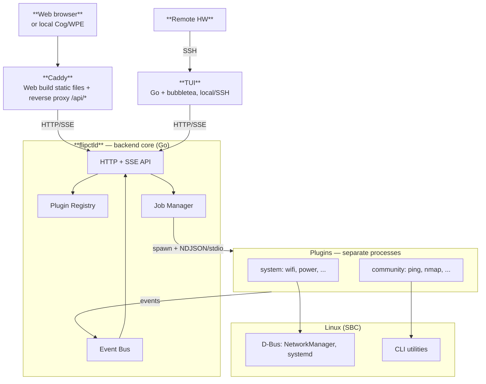
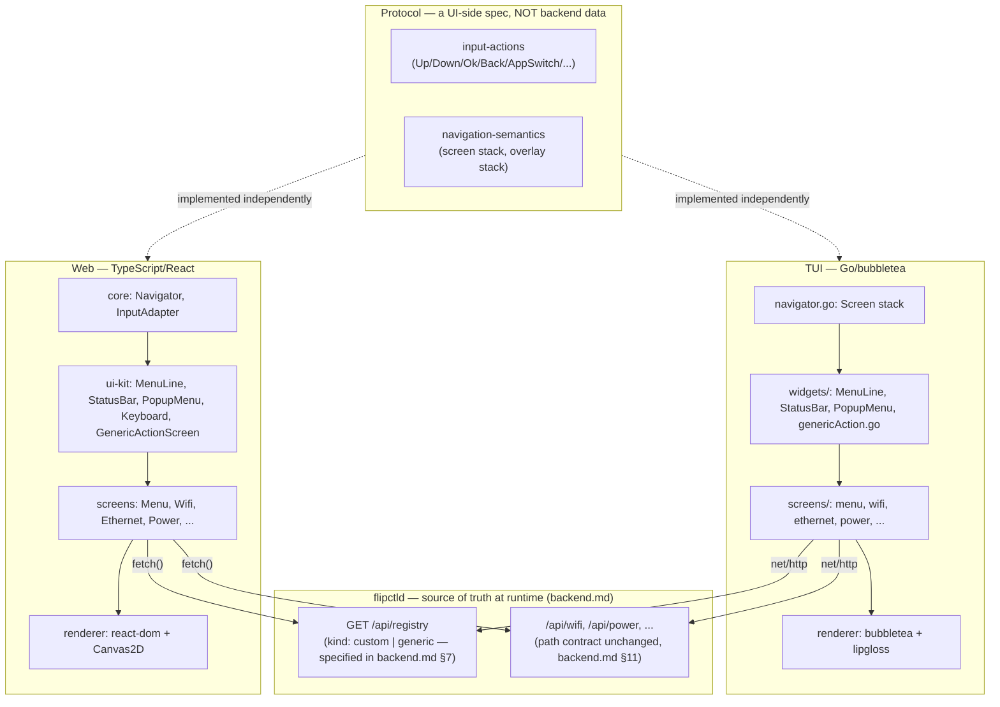
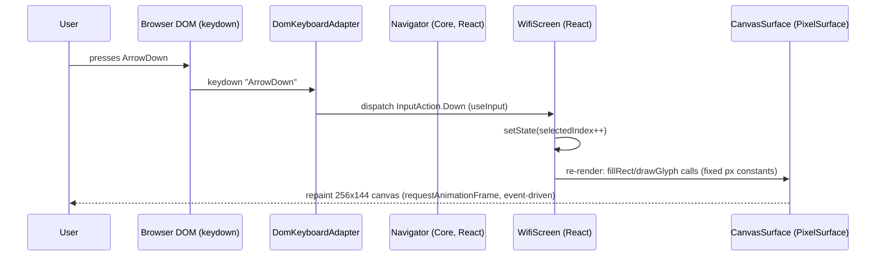
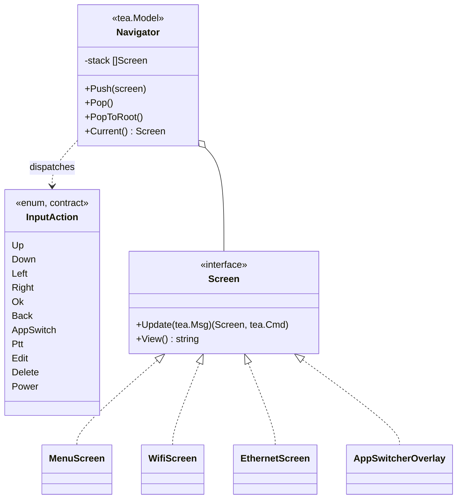
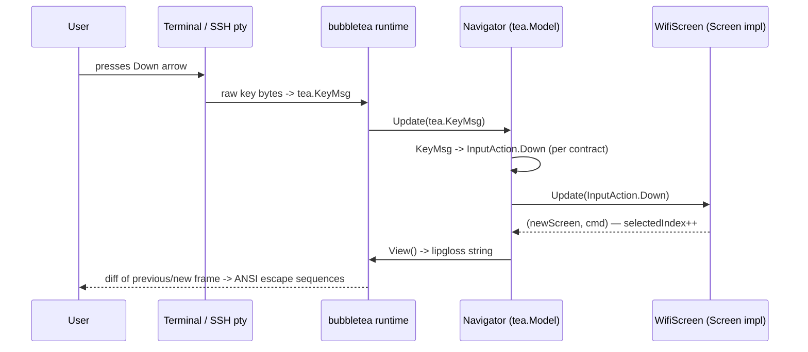
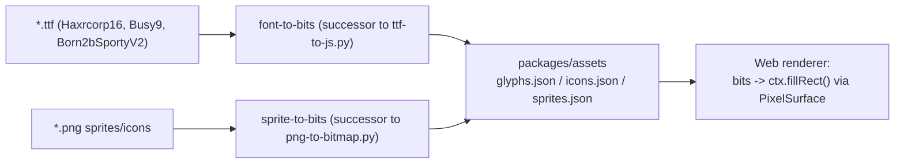

# FlipCTL — UI and Renderer Layer Architecture (proposal)

> Scope of this document: only the **UI Frontend** and **Renderer** from FlipCTL's overall design (see `README.md`). The backend is designed separately, in the companion document [`backend.md`](./backend.md) — here only the API contract it must provide matters (in particular `GET /api/registry`, section 4.2), not its internals. Target platforms for the PoC — **Web** and **TUI** (SSH/local terminal), with an eye toward a future hardware/DRM renderer. The device is an embedded Linux host in the SBC class: limited memory, CPU/battery savings matter, extra resident runtimes are a real cost, not an abstract risk.

## High-level overall architecture (for reference)



## 1. Problem statement and constraints

From `README.md`:

- The UI today is HTML/JS, rendered by headless WebKit (Cog) directly on DRM, without Xorg/Wayland.
- We want several renderers for one UI: at minimum Web and TUI, with an eye toward a hardware target in the future.
- Web must be pixel-perfect: a 1-bit/grayscale style on a 256×144 screen (see `fake-flipctl2`), custom bitmap fonts, sprites.
- **TUI doesn't need to be pixel-perfect.** It's not "the same screen in text form," but a full text interface with its own terminal aesthetic. Web and TUI need to be recognizably the same navigation/structure, but aren't required to match visually.
- The device is embedded, with limited resources and power consumption in mind. An extra resident runtime (a JS engine, a WASM runtime) on the TUI side isn't a free abstraction — it's a real line item of RAM/CPU/battery cost, especially if the TUI is launched interactively (an SSH session, a local terminal).

This directly drives the document's key architectural decision (section 2): rejecting the idea of "one React tree for both targets" in favor of two independent, platform-idiomatic implementations connected by a shared *contract*, not a shared *runtime*.

---

## 2. Key decision: a shared contract, not a shared component tree

### 2.1 Considered and rejected alternative

The first version of this document proposed a React Native/Ink/Dioxus-style pattern: one React tree, two React reconcilers (`react-dom` for Web, `@opentui/react` for TUI), a shared Yoga layout to keep coordinates in sync. The approach has mature precedents (React Native + react-native-web, Ink, Dioxus with a ratatui-based TUI renderer) — and it remains a valid choice for projects where the TUI also needs to be pixel-perfect, or where Node/Bun is already guaranteed on the TUI side.

Reason for rejecting it specifically for FlipCTL:

1. The TUI doesn't need to be pixel-perfect → the main argument for "draw both through a shared low-level canvas/cell-buffer API" disappears.
2. The resource-saving requirement on an embedded device makes Node/Bun/OpenTUI+Yoga(WASM) on the TUI side an unjustified price for code sharing that would be partial anyway (widgets would still need different styling per platform).
3. The TUI is simpler in composition anyway (text, frames, no sprite animations) — losing code sharing right here is cheap.

### 2.2 Decision made

Two independent stacks, each native to its own ecosystem:

- **Web:** React + `react-dom` + Canvas2D — as before, to preserve the pixel-perfect 1-bit aesthetic (section 5).
- **TUI:** **Go + `bubbletea`** — compiled, native, with no separate JS runtime at all (section 6). The same language as the backend core (`backend.md`) — unlike the first version of this decision (Rust), this gives real synergy on shared API-contract types rather than a documented trade-off (`backend.md §11.1`).

What's shared between them isn't code, but a **contract** — and the contract here isn't uniform in nature. Part of it is a protocol that the UI layer itself invents and maintains (what input actions exist, how the navigation stack works). Part of it is **data owned by the backend at runtime**: which apps/screens even exist in the system right now is determined not by the UI repository, but by the backend plugins installed on the device (see section 4.2). Neither UI implementation stores the app list itself — both ask the backend for it at startup, like any other data.



---

## 3. What we're carrying over from `fake-flipctl2`

| Prototype module | Role | Fate |
|---|---|---|
| `js/canvas.js` (`FlipCanvas`) | Drawing pixels/sprites/icons on canvas | The rasterization logic is ported into the Web `renderer` almost as-is (section 5). The TUI doesn't use it. |
| `js/scene.js` (`SceneManager`) | The screen stack: push/pop/enter/exit | The semantics are fixed in `contract/navigation-semantics`; on Web it's implemented as a React `Navigator` (Context/reducer); on TUI — neither `bubbletea` nor (previously) `ratatui` has a built-in screen stack, so the `Navigator` is built by hand on top of the framework's primitive — in Go that's a `tea.Model` holding a `stack []Screen` and delegating `Update`/`View` to the top of the stack. The push/pop/enter/exit semantics are the same; the style is functional (Elm architecture: `Update` returns a new `Screen` rather than mutating the old one), not imperative the way it would be in Rust. |
| `js/input.js` (`Input`, `KEY_MAP`) | Key → semantic action | The semantics (`Up/Down/Left/Right/Ok/Back/AppSwitch/Ptt/Edit/Delete/Power`) are fixed in `contract/input-actions`; on Web — `DomKeyboardAdapter` (`keydown`/`keyup`); on TUI — mapping `tea.KeyMsg` → the same enum (a Go `const` block). |
| `js/apps/*.js` (~30 scenes) | Screen = `{enter, exit, handleInput, render}` | Rewritten as React components on Web. On TUI — as types implementing the `Screen` interface, in their own `screens/` package. |
| `js/component-library/*.js`, `js/ui.js` | MenuLine, ResponsiveFrame, PopupMenu, Keyboard, MessageBox, Scrollbar, TextInputBox/InputField | Carried over as React components almost 1:1 on Web. On TUI — the **naming and semantics** are reused (its own `widgets/menuLine.go` etc.), the implementation is Go + `lipgloss` for styling, and where possible, ready-made `bubbles` components (`bubbles/list`, `bubbles/textinput`, `bubbles/viewport`) instead of writing them from scratch. The prototype's virtual on-screen `Keyboard` most likely **isn't needed** on TUI — the terminal already implies a real keyboard (see section 8). |
| `js/running_apps.js` | The MRU list of open apps, a static list of scenes in `index.html` | The app list stops being something that lives in the UI repository at all. It comes from the backend at runtime (`GET /api/registry`, section 4.2) — the MRU list of open windows (the App Switcher) remains local UI state (what's currently open), while *what apps even exist* is backend data reflecting installed plugins. |
| `js/font.js`, `js/haxrcorp16.js`, `js/busy9.js`, `js/born2bsportyv2.js`, `js/icons.js`, `js/sprites.js`, `js/animated_icons.js` | Bit-packed font/icon/sprite data | Used **only by the Web renderer** (section 7). The TUI doesn't consume them — terminal icons are represented by short text labels/symbols via a separate small `icon-id → &str` lookup table. |
| `ttf-to-js.py`, `png-to-bitmap.py` | Offline TTF/PNG → JS conversion | Stay a Web-only part of the asset pipeline. |
| `server.js` (`/api/*`) | An HTTP API over system utilities | **Replaced by `flipctld`** — completely rethought as a plugin supervisor rather than a file of handlers (see `backend.md`). The path contract (`/api/*`) is preserved, so Web (`fetch`) and TUI (`net/http`) talk to it with no changes to their own code. |

---

## 4. Contract — what's left in it, and what the backend now provides

After the revision (section 4.2), the contract is no longer a uniform set of files in the UI repository. Now it's two fundamentally different sources of truth.

### 4.1 Protocol — still a UI-side spec

What the backend has no business with — the semantics of interacting with the interface, not the system's problem domain:

- **`input-actions`** — an enum of ~11 values (`Up/Down/Left/Right/Ok/Back/AppSwitch/Ptt/Edit/Delete/Power`). The backend can't know what pressing a physical button or an arrow key means — this is purely about how Web and TUI interpret input.
- **`navigation-semantics`** — the screen-stack model (push/pop/popToRoot, a separate overlay stack for popups/the App Switcher).

Both specs are small, stable, and change rarely — documented as a markdown spec and implemented independently (a TS enum on Web, a Go `const` enum on TUI), with no shared data file, because there's essentially nothing to share — it's behavior, not data.

### 4.2 App Registry — runtime data, source of truth is the backend

The key correction in this section: **the list of apps/screens isn't stored in the UI repository at all**, not as a static file, not as a build-time constant. It comes from the backend at runtime, because it's the backend that knows which wrapper plugins (`ping`, `nmap`, a Wi-Fi manager, etc. — see the README on the plugin system) are installed and enabled on a given device right now. Both Web and TUI request it at startup the same way they request any other data — through a new `GET /api/registry` endpoint.

**This requires a new backend endpoint that doesn't exist in `server.js` today.** It's fully specified in `backend.md §7` (implementation — a `Plugin Registry` projection, `backend.md §8`) — the implementation itself is outside this repository's code, but the contract is no longer an open question.

Every registry entry is tagged with a `kind` field, so as not to drag a general-purpose "describe arbitrary UI" language into the architecture (see the discussion in section 11 on the limits of the generic approach):

- **`kind: "custom"`** — the screen is entirely hand-written in each frontend (Wi-Fi, Ethernet, Power, sound, TV — anything with non-trivial behavior: a network list, password entry, an audio stream). The backend only provides metadata for the menu/icon; the screen itself is resolved by `id` against a static `id → component` table, separate on Web and on TUI (section 3, also true in the document's first version).
- **`kind: "generic"`** — the screen is entirely described by data: parameters before launch (`inputs`), status fields during/after execution (`status_fields`), and a list of action buttons (`actions`), each a call to a specific backend endpoint. Rendered by **one** shared component per platform (`GenericActionScreen` on Web, `generic_action.rs` on TUI), with no platform-specific code for each new plugin. This is a direct answer to the README's "vision for a plugin system for CLI utilities": a simple wrapper (`ping`, `traceroute`) registers itself with a description — and immediately appears in both UIs.

The schema is aligned with the plugin manifest from `backend.md §4.1` — `inputs`/`status_fields` here are the UI projection of the manifest's `inputs`/`outputs`; the same `ping` appears in both documents with the same fields:

```jsonc
// GET /api/registry — example response (the endpoint is specified in backend.md §7)
[
  {
    "id": "wifi", "title": "Wi-Fi", "icon": "wifi", "category": "network",
    "kind": "custom"
  },
  {
    "id": "ping", "title": "Ping", "icon": "network-ping", "category": "diagnostics",
    "kind": "generic",
    "inputs": [
      { "id": "target", "label": "Target", "type": "text", "required": true },
      { "id": "interval", "label": "Interval", "type": "select", "options": ["1s", "5s", "continuous"], "default": "1s" }
    ],
    "status_fields": [
      { "label": "Status", "source": "status", "type": "text" },
      { "label": "RTT", "source": "rtt_ms", "type": "number" },
      { "label": "Log", "source": "log", "type": "list" }
    ],
    "actions": [
      { "id": "run", "label": "Run", "endpoint": "/api/plugins/ping/run", "bind": "slot:2" },
      { "id": "stop", "label": "Stop", "endpoint": "/api/plugins/ping/stop", "bind": "slot:4" }
    ]
  }
]
```

`bind` is a position on the screen's soft-button panel (`slot:0..4`, or `input:<name>` for universal actions like `input:ptt`), a projection of the manifest field of the same name (`backend.md §4.4`). On press/release, the frontend sends `POST {endpoint}` with body `{"phase": "down" | "up"}` (`backend.md §7`) — press/release are already distinguished at the `InputAdapter` level (section 4.1); here it's just forwarded on to the backend.

The `type` on a field (`text`/`number`/`select`/`list`) determines which already-existing UI Kit widget draws it — no new primitives are needed for this:

| `type` | Web/TUI widget |
|---|---|
| `text` (input) | `TextInputBox`/`InputField` + a virtual `Keyboard` (Web) / `bubbles/textinput` (TUI, section 6.2) |
| `select` (input) | `PopupMenu` acting as a picker (Web) / `bubbles/list` in an overlay (TUI) — already in the UI Kit (section 3) |
| `text`/`number` (status) | a regular line in a `MenuLine`-style layout |
| `list` (status) | `Scrollbar` + a list of lines — already in the UI Kit (section 3) |

For the PoC (section 12), only `kind: "custom"` is needed — it covers Wi-Fi/Ethernet from the plan. `kind: "generic"` and its associated `/api/plugins/<id>/<action>` namespace are baked into the schema ahead of time, so no breaking change is needed once real CLI-wrapper plugins are due.

### 4.3 The API contract for everything else

The shape of JSON responses from the rest of the backend's (`flipctld`, see `backend.md`; historically `server.js`) `/api/*` endpoints — `/api/wifi`, `/api/power`, ... — the path contract doesn't change, though the implementation behind it is completely rewritten. Web maintains its own TS interfaces (generated from `openapi.yaml`, kept in sync with the schema by hand); the TUI, being in the same language as the backend, uses the shared generated Go package `contract/go/apitypes` (section 9) — no manual struct mirroring.

Explicitly NOT shared: widget code, layout logic, drawing code. This is a deliberate trade-off from section 2.

---

## 5. Renderer: Web

Essentially unchanged from the document's first version, with one simplification.

- **Stack:** React + `react-dom` + Vite + TypeScript.
- **Pixel-perfect UI inside the DOM:** `ScreenFrame` is a single 256×144 `<canvas>` (`image-rendering: pixelated`), managed declaratively through React (`ref` + `useLayoutEffect`). React handles the component tree/state/effects and the page's DOM shell; the screen itself is drawn via 2D-context calls ported from `js/canvas.js`, `js/font.js`, `js/icons.js`.
- **Layout — no Yoga.** In the document's first version, Web and TUI were supposed to share a flexbox engine (Yoga) to keep coordinates in sync. Since the TUI no longer needs to visually match Web, that reason is gone. We go back to what already works well in the prototype: **fixed pixel constants** (a 20px menu-line height, a 13px status bar, safe margins, etc. — see `fake_flipctl2_CLAUDE.md`) instead of a separate layout engine. Fewer dependencies, less WASM, nothing lost — a fixed-size screen never needed a dynamic flexbox anyway.
- **`PixelSurface` — a narrow, justified abstraction for the future.** Unlike the wide Web/TUI `Primitives` contract from the first version (dropped), only one small interface remains here: `PixelSurface`, with `fillRect`/`drawGlyph`/`drawSprite`/... methods, which today has one implementation — `CanvasSurface` (a wrapper around `HTMLCanvasElement`). This specifically lays the groundwork for a **future hardware target** (headless WebKit/Cog on DRM, from the README): drawing into a browser canvas and drawing into a real DRM dumb buffer are operations of the same kind (blitting pixels into a buffer), and all the code built on top of `PixelSurface` (fonts, icons, widgets) won't know which implementation is underneath. The TUI isn't part of this abstraction — it has a fundamentally different drawing model (text cells, not pixels).
- **Accessibility and testability.** The Web UI Kit's `Box`/`Text`/`Pressable` components, alongside drawing to canvas, also place an invisible (to the eye, visible to screen readers) accessibility tree in the DOM with roles/labels and `data-testid` — a standard trick for canvas/WebGL apps, and it doesn't block Playwright/Testing Library tests.



### Deployment: Caddy

The production build (`vite build` → static files) isn't served by the frontend code itself — it's served by `Caddy`, a separate process in front of `flipctld` (full description — `backend.md §3.1`). For a Web developer this means: `fetch('/api/registry')` and the rest of the calls to the `api-contract` (section 4) go to the same origin that served `index.html` — Caddy transparently proxies `/api/*` to the backend, and no CORS handling is needed in dev or in production. A local Cog/WPE and an external browser reach the same UI through the same Caddy entry point, with no different frontend behavior depending on who opened it.

---

## 6. Renderer: TUI (Go + `bubbletea`)

> Revised relative to the previous version (Rust + `ratatui`): the TUI has been rewritten in Go specifically for synergy with the backend core (`backend.md`, also Go) — shared API-contract types instead of manual synchronization between languages. The decision itself to drop a shared React tree (section 2.1) isn't being revisited — the TUI is still native, compiled, with no Node/JS runtime, just in a different language than in the first revision.

### 6.1 Overall model

[`bubbletea`](https://github.com/charmbracelet/bubbletea) is Charm's TUI framework built on the Elm architecture (Model/Update/View): `Update(tea.Msg) (tea.Model, tea.Cmd)` returns a new model rather than mutating the old one; repainting happens on events (bubbletea diffs frames itself) — the same redraw-on-change principle as in the prototype, just in a functional rather than imperative style. [`lipgloss`](https://github.com/charmbracelet/lipgloss) handles styling and layout on top of ANSI (Padding, Border, `JoinHorizontal`/`JoinVertical`, color degradation based on terminal capability). [`bubbles`](https://github.com/charmbracelet/bubbles) is a ready-made component library from the same team (list, viewport, textinput, spinner, table) — some of the widgets below aren't written from scratch, they're assembled on top of it.



- Neither `bubbletea` nor (in the first revision) `ratatui` has a built-in screen stack — bubbletea manages exactly one root model. The `Navigator` implements `tea.Model` itself (that's the only thing the bubbletea runtime sees) and internally holds a `stack []Screen`, delegating `Update`/`View` to the top of the stack — a direct analogue of the prototype's `SceneManager` (section 3), just built on top of the Elm architecture rather than on mutable objects.
- Transitions (push/pop) are `tea.Cmd`s returned by a `Screen` itself while handling `Update` (e.g. pressing Ok on a menu item returns a `pushScreenMsg{WifiScreen{}}` command), which the `Navigator` intercepts and applies to the stack.
- The overlay stack (App Switcher, popups, confirmation dialogs) is a second, identical stack, rendered on top of the main one by overlaying strings (`lipgloss.Place`), with no special tricks.

### 6.2 Widgets (`widgets/`) — a parallel (not shared) implementation of the UI Kit

Widgets are named the same as in the Web UI Kit (`MenuLine`, `StatusBar`, `PopupMenu`, `Dialog`, `Scrollbar`), so an engineer reading both stacks doesn't have to keep two vocabularies in their head — the implementation is independent, Go + `lipgloss`, and where possible built on top of ready-made `bubbles` components instead of writing from scratch:

| Widget | Implementation |
|---|---|
| `Scrollbar` / a list | `bubbles/viewport` + `bubbles/list` |
| `TextInputBox`/`InputField` | `bubbles/textinput` |
| `PopupMenu` / a picker (`select` inputs, section 4.2) | `bubbles/list` in an overlay |
| `StatusBar`, `MenuLine`, `Dialog` | our own Go + `lipgloss`, no ready-made analogue in `bubbles` |

The prototype's virtual on-screen `Keyboard` still isn't needed on the TUI — SSH/a local terminal already imply a physical keyboard; text input is `bubbles/textinput`, with no on-screen QWERTY layout.

A separate `genericAction.go` widget renders `kind: "generic"` registry entries (section 4.2): a list of status fields + action buttons, built from the JSON description in `GET /api/registry`, with no dedicated package in `screens/` for every new CLI-wrapper plugin. A direct analogue of the Web `GenericActionScreen` component.

### 6.3 Input

bubbletea delivers key presses as `tea.KeyMsg` into `Update`; a thin mapper at the top of `Navigator.Update` translates `msg.String()`/`msg.Type` into the same `InputAction` defined in the contract (section 4) — arrows, Enter→Ok, Esc/Backspace→Back, Tab→AppSwitch, etc. No separate adapter as its own component is needed — it's just a function at the entry of `Update`.

### 6.4 Data

A thin HTTP client layer (`data/`), the analogue of the Web `data` package, talks to the same `/api/*` endpoints on the backend (`flipctld`, see `backend.md`):

- HTTP requests — standard `net/http`, no third-party crate/package needed (unlike the Rust version, where we chose between `ureq`/`reqwest`).
- SSE (`GET /api/jobs/{id}/events`, `backend.md §7`) — the format is trivial (`data: {...}\n\n`), read line by line via a `bufio.Scanner` over `resp.Body`; a library like `r3labs/sse` is an option if a ready-made reconnect/`Last-Event-ID` is needed, not required for the PoC.
- JSON — standard `encoding/json`.
- **Real synergy with the backend, not a plan documented for later:** since `flipctld` and the TUI are now both on Go, API-contract types are generated once from `contract/openapi.yaml` (`oapi-codegen`) into a shared Go package and imported directly into both `flipctld` and the TUI binary — no manual struct mirroring, and no codegen step at the TUI↔backend boundary (section 9, `backend.md §11.1`). For Web (TypeScript), codegen from the same `openapi.yaml` remains a separate step (`openapi-typescript`) — Web is inevitably a different language.

### 6.5 Deployment: local terminal and SSH

A compiled native binary with no external runtime — both scenarios from the README are covered by simple, standard embedded-Linux means; nothing has changed at the approach level compared to the first revision:

- **Local terminal:** a systemd getty unit on a dedicated tty (`ExecStart=/usr/bin/flipctl-tui`, autologin) — a direct analogue of how the `cage` unit brings up the Cog/Web kiosk on its tty in the prototype.
- **SSH, option A (recommended for the PoC):** the regular system `sshd` + a forced command / a dedicated login shell for the `flipctl` user (`ForceCommand /usr/bin/flipctl-tui` in `sshd_config`, or `command=` in `authorized_keys`). `ssh flipctl@host` drops straight into the TUI. Already-configured system-sshd authentication/hardening is reused; we write nothing of our own in the security space — this consideration doesn't depend on the TUI's language and still holds.
- **SSH, option B (a more natural future candidate than `russh` used to be):** [`wish`](https://github.com/charmbracelet/wish) — an SSH middleware from the same Charm ecosystem as `bubbletea`, with a ready-made `bubbletea` middleware (`wish/bubbletea`) that brings up a separate bubbletea session with almost no code on every connection. The integration is noticeably less homegrown than it would have been with `russh` in the Rust version — but the authentication policy still has to be designed ourselves, so option A remains simpler and lower-risk for the PoC.



---

## 7. Asset pipeline — now Web-only

Since the TUI doesn't consume pixel assets, the pipeline simplifies down to a single branch (it used to be a shared manifest for two consumers):



The only thing that genuinely needs to be shared between Web and TUI at the asset level is the icon's **semantic name** (`icon: "wifi"`, `icon: "battery"`, ...), which now comes from the backend as the `icon` field in the `GET /api/registry` response (section 4.2), rather than being stored in the UI repository. Web resolves it into a bit-packed sprite; TUI resolves it into a short text label/symbol via its own small static table (`icon_glyphs.rs`, something like `"wifi" => "WiFi"`, `"battery" => "[||| ]"`), with no shared asset format.

---

## 8. What's genuinely shared, and what's different — a summary

| Aspect | Web | TUI | Shared? |
|---|---|---|---|
| Language/runtime | TypeScript, a browser JS engine (client-side) | Go, a native binary | No, but the TUI is now in the same language as the backend |
| Navigation (push/pop, overlay stack) | A React `Navigator` (Context/reducer) | A Go `Navigator` (`tea.Model`, `[]Screen`) | Semantics — yes (contract), implementation — no |
| Input semantics (`Up/Down/Ok/Back/...`) | A TS enum + `DomKeyboardAdapter` | A Go `const` enum + a `tea.KeyMsg` mapper | Semantics — yes (contract), implementation — no |
| The app/screen list (id, title, category) | `fetch("/api/registry")` | `http.Get("/api/registry")` | Yes — a shared backend endpoint (new, section 4.2), not a file in the repository |
| Backend API (`/api/wifi`, `/api/power`, ...) | `fetch()` | `net/http` | Data-shape contract — yes, client code — no |
| API-contract types | Generated separately (`openapi-typescript`) | A Go package shared with `flipctld` (`oapi-codegen`, `backend.md §11.1`) | Yes, literally, between TUI and backend (one codebase); with Web — only the schema |
| Widgets (MenuLine, StatusBar, PopupMenu, ...) | React components on top of Canvas | Go + `lipgloss`/`bubbles` implementations | Naming/semantics only, not code |
| Rendering `kind: "generic"` plugin screens | `GenericActionScreen` (React) | `genericAction.go` (`lipgloss`/`bubbles`) | The JSON schema — yes; the rendering component — no (two independent ones sharing one schema) |
| Pixel accuracy / bitmap fonts, sprites | Yes, a requirement | No, not required | No |
| An on-screen virtual keyboard | Yes (no physical one on the device) | Not needed (there's a terminal/SSH client with a keyboard) | No |
| Layout model | Fixed pixel constants (as in the prototype) | `lipgloss` (Width/Height/Padding/`JoinHorizontal`/`JoinVertical`) | No, different models, each standard for its own platform |

---

## 9. Monorepo / repository structure

Since Web and TUI are still in different languages (TypeScript vs. Go), it makes sense to keep the toolchains separate, but keep `contract/` at the root as a shared source of truth — both for the protocol, and now also for the generated Go types shared with the backend:

```
flipctl-ui/
├── contract/                      # see contract/README.md at the repo root
│   ├── input-actions.md         # the InputAction enum spec
│   ├── navigation-semantics.md  # the navigation/overlay stack spec
│   ├── openapi.yaml             # the backend's (flipctld) HTTP/SSE API, including GET /api/registry
│   ├── manifest.schema.json     # the plugin manifest schema (see backend.md §4)
│   ├── ipc-messages.schema.json # the flipctld<->plugin NDJSON protocol schema (see backend.md §5)
│   └── go/apitypes/             # oapi-codegen output from openapi.yaml — a shared Go package,
│                                 # imported directly by both flipctld (backend.md) and tui/
│
├── web/                          # TypeScript / React
│   ├── apps/web/                 # Vite entry point
│   └── packages/
│       ├── core/                 # Navigator, InputAdapter, data hooks (incl. useRegistry())
│       ├── ui-kit/                # MenuLine, StatusBar, PopupMenu, Dialog, Scrollbar, GenericActionScreen
│       ├── screens/               # Menu, Wifi, Ethernet, Power, ... (kind: "custom")
│       └── assets/                # generated fonts/icons/sprites
│
├── tui/                           # Go
│   ├── go.mod                     # require .../contract/go/apitypes
│   ├── main.go
│   ├── navigator.go               # Navigator (tea.Model), the Screen stack
│   ├── input.go                   # tea.KeyMsg -> InputAction
│   ├── data/                      # net/http clients to the backend API, using apitypes
│   ├── widgets/                   # menuLine.go, statusBar.go, popupMenu.go, genericAction.go, ...
│   └── screens/                   # menu.go, wifi.go, ethernet.go, power.go, ... (kind: "custom")
│
└── tools/
    └── asset-pipeline/            # successors to ttf-to-js.py / png-to-bitmap.py, Web-only
```

`contract/go/apitypes` isn't a new entity, but the concrete realization of what this section used to call the "shared contract" only in words: a real Go package that `tui/go.mod` pulls in directly as a dependency (via `go.work`, or an ordinary `require` against a published module/local path), with no codegen step at the TUI↔backend boundary — codegen is only needed between `openapi.yaml` and this package (once), not between TUI and `flipctld`.

---

## 10. Technology stack

| Area | Technology | Rationale |
|---|---|---|
| Web — language | TypeScript | Type safety on top of the `api-contract`. |
| Web — UI | React + `react-dom` | An explicit requirement from the client; a mature ecosystem. |
| Web — rendering | Canvas2D (`PixelSurface`/`CanvasSurface`), no Yoga/WASM | The pixel-perfect requirement; forward-compatibility with a future DRM target (section 5). |
| Web — build | Vite | The de facto standard for React+TS in 2025-2026, HMR, minimal boilerplate. |
| TUI — language | Go | The same language as the backend core (`backend.md`) — real synergy on shared contract types instead of manual synchronization between languages; a compiled binary, minimal RSS/startup time, no resident JS runtime. |
| TUI — rendering | `bubbletea` + `lipgloss` (+ `bubbles` for ready-made components) | The Elm architecture, a mature and widely used-in-production Charm ecosystem, no GPU/browser engine required. |
| TUI — HTTP client | `net/http` (stdlib) | No third-party package needed — unlike the Rust version, where we chose between `ureq`/`reqwest`. |
| TUI — SSH | The system `sshd` + a forced command (by default); `wish` (Charm) — an option for a fully self-contained device, with ready-made bubbletea integration | See section 6.5. |
| Protocol (input-actions, navigation) | Markdown specs, implemented by hand in TS and Go | Doesn't require a shared runtime/codegen at PoC scale; cheap to maintain by hand at ~11 InputAction values. |
| App Registry | `GET /api/registry` (a new backend endpoint), JSON with a `kind: "custom" \| "generic"` field | The source of truth is the backend/plugins, not the UI repository; see section 4.2. Requires implementation on the backend side (out of this document's scope). |
| Data (Web) | Native `fetch`/`EventSource`-compatible wrappers around the backend API | The backend has been completely rethought (`backend.md`, Go), but the path contract (`/api/*`) is preserved — the Web code doesn't change. |

---

## 11. Risks and open questions

- **Manual protocol synchronization.** `input-actions`/`navigation-semantics` are maintained by hand in two places (TS and Go) — these are still two different languages; switching the TUI stack from Rust to Go doesn't remove this specific problem (it's about Web vs. TUI, not TUI vs. backend). At the current small size the risk is low, but it's worth setting up a simple CI check (a unit test on each side comparing enum variant names against the value baked into `contract/*.md`), rather than relying on discipline alone.
- **`GET /api/registry` — a new backend endpoint that doesn't exist in `server.js` today.** The risk is largely resolved: the endpoint is fully specified in `backend.md §7`/§8 (a companion document, not a "black box" — see the header fix mentioned above). What's left is only the actual implementation on the backend side, outside this repository's code, but the contract is agreed between the documents.
- **Behavior when `/api/registry` is unavailable at startup.** An embedded device may bring up the backend and the UI in no particular order, and the network/local socket may be temporarily unavailable. A strategy needs to be decided: retries with backoff, caching the last successful response (where would that be stored on the TUI side — a temp file?), or just an empty menu + an error banner. Not worked out in this document.
- **Versioning the `kind: "generic"` schema.** The `status_fields`/`actions` format from section 4.2 is essentially a small DSL. If it grows (conditional field visibility, input validation, different action types), it's worth thinking from the start about a `schema_version` in the `/api/registry` response, so new plugins don't break old clients.
- **Terminal limitations over SSH** (a restricted `TERM`, no true color on some sessions, varying terminal sizes) — `lipgloss` can degrade color via `termenv`, but layout/fallback styles for a "poor" terminal are worth explicitly planning for in `widgets/`, not as an afterthought.
- **`wish` (an SSH server in the binary)** — not tested in this document against a real PoC; if we decide to use option B from section 6.5, a separate investigation is needed (resize/`SIGWINCH` through a `wish` session, an authentication policy — the library itself doesn't decide who's allowed access).
- **Splitting `tui/` and `flipctld` into two Go modules with a shared `contract/go/apitypes`** (section 9) — this linking scheme hasn't been proven in practice (via `go.work` in dev — but what exactly in production? Publishing the package? A local path?). The alternative — merging `tui/` and `flipctld` into one Go module/monorepo for even more direct sharing — was deliberately not chosen now, so as not to break the split into two documents/repositories (frontend.md/backend.md), but it remains a cheap option if separate modules prove inconvenient in practice.

---

## 12. PoC roadmap

1. `contract/`: lock down `input-actions.md`, `navigation-semantics.md`.
2. Backend: implement a minimal `GET /api/registry` serving 3-4 test apps with `kind: "custom"` (the endpoint itself is the responsibility of whoever owns the backend, outside this repository's code).
3. Web: `PixelSurface`/`CanvasSurface` + a `MenuScreen` reading the list from `GET /api/registry` — prove that drawing via `PixelSurface` matches the prototype pixel for pixel.
4. TUI: a `Navigator` (`tea.Model`) + a `Screen` interface + a `MenuScreen` on `bubbletea`, reading the same `GET /api/registry` — prove that both targets genuinely behave as the same navigation over the same backend data.
5. Wire up both targets to 1-2 real `kind: "custom"` screens (Wi-Fi, Ethernet) through the backend (`flipctld`, see `backend.md §13` step 4) — prove that the `server.js` → `flipctld` transition required no changes to the existing `/api/*` for either renderer.
6. Deploy the TUI binary via systemd getty (a local tty) and via forced-command SSH — verify both entry scenarios from the README.
7. (Optional, after the PoC) `kind: "generic"`: `GenericActionScreen`/`generic_action.rs` + one real CLI-wrapper plugin (e.g. `ping`) — verify that a new plugin genuinely requires no changes to the UI code.
