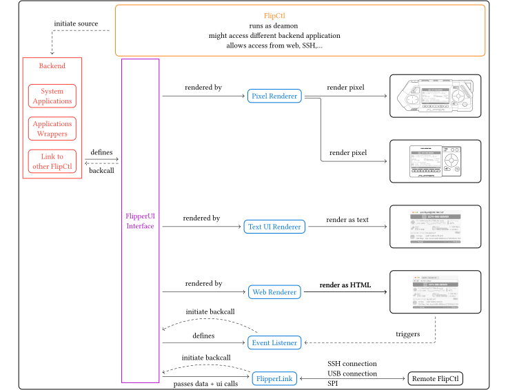

# FlipCtl Architecture Proposal

## Top level Architecture

## Detailed Designs

### Backend

Ideally language independent,
so adaption for the developer providing the binary is minimal.
There might be (automatic) generated interfaces on how to define,
the `FlipperUI` (see next section)
and interaction with such from the application side.

### Introducing `FlipperUI`

> [!NOTE]
> This might be the biggest difference to the design proposed at the moment:
>
> I would not use `HTML`-`JS` in the definition of the UI,
> but rather a minimal custom language, perfectly fitted for the UI goals of `FliCtl`.
>
> The `HTML`-`JS` is suitable, as soon as we choose a web interface renderer.
> However, for the other interfaces, especially the pixel based interface,
> I think that `HTML` is way too complex and not really fitting the requirements.
> In the end developer try to fit complex `HTML` designs into a minimal pixel interface,
> instead of rethinking it to match the way the flipper operates.
> For sure this adds some overhead to the development,
> but rather has some mayor advantages.
> Given a standard `HTML` interface there might be a ton of UI bugs,
> regarding width, layout, …, that would need to be fixed to display is nicely on tiny display.
> With a minimal design approach we limit the developer from the beginning,
> and then can just scale this design to also look great on a bigger screen.

A minimal user interface inspired by
[Flutter](https://docs.flutter.dev),
[SwiftUI](https://developer.apple.com/documentation/swiftui),
but greatly stripped and simplified.

Separation of scopes:
This `FlipperUI` is only responsible on defining,
what are the frames for displaying the data,
as well as triggering backcalls to the backend,
when there is interaction with the device.
Also, it can fetch data it needs to display from the backend,
when it needs to do so (this allows lazy rendering what might be nice for long lists…).
It should not be responsible for any application logic,
as well as view changes.
It only looks at the `source of truth` from the backend,
and renders its view accordingly.
(If some views should also own their own state [like a list's scrol position],
might be worth discussing.)

> [!NOTE]
> This is also a bigger difference to `HTML`, which mixes much more semantic scopes,
> that were supposed to be helpful when rendering webpages without `CSS`,
> which is barely done today.
> As a takeaway, we gain more simplicity and less overhead.

#### Constructive UI Approach

- Base Components:
  - Image (prob. 10x10px/maybe flexible?)
  - Text
  - Space

- Composite View:
  Users define there view by composing
  base components and other views to more complex views.

- `FlipCTL` default Views:
  Views that might be shared between applications:
  - (scrollable) List / Table?
  - Tree View?
  - … ?

### Renderer

Matching to Interface defined in the UI to the interface at place.

This is a one-directional architecture,
which allows a super simple straight forward implementation
of the different renderers.
Formally, the `FlipperUI` language/interface is in that case
a subset of the available final interfaces (pixel, text, web).

> [!NOTE]
> There might be an `Event Listener` for each supported interface type.

> [!NOTE]
> The FlipCtl Control Panel directly connects to the `PixelRenderer`
> as well as to the `EventListener` via SPI, USB-C.
> It does not handle any logic itself.
> In the case it should manage the device it is connected to,
> it might run its own instance of `FlipCtl`.
> However, that would require much more computing power.
> (Otherwise, it just can be a screen and some buttons).

### Open Questions

- Is the UI / FlipCtl thread independent of the backend thread?
